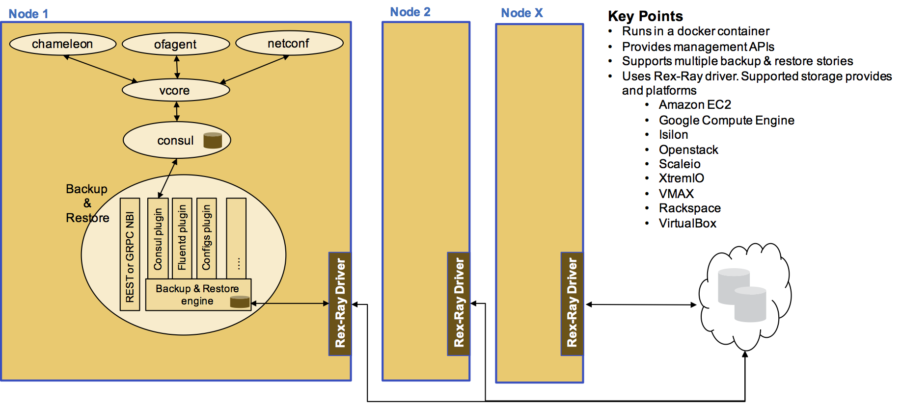

# Backup and Restore

The strategy for backup and restore for the entire Voltha cluster is 
depicted in the diagram below.

 
 
 Implementation of this strategy would be done post-PoC3.   
 
For PoC-3, the strategy is to backup and restore Consul data manually.

## Backing Up Consul Data

There are two sets of data that could be backup and restored from Consul:

* The KV store using Consul's export/import commands
* All data using Consul's snapshot command

The focus is on the KV store as this is the only Consul data that needs to be 
backed up for Voltha.  We will initiate the backup and restore operations 
from the voltha/tools container.
 
The steps below show the basic backup and restore procedure.   Consul provides
 additional options, e.g. authentication, to use during these operations.  

## Backup

### Backup prerequisites

* Consul is running

#### Backup steps

* Get the IP and port number of one of the running consul node.
* Enter the voltha/tools container on one of the cluster node:

```angular2html
docker exec -it <containerid> bash
cd /home/tools
```

* Initiate the backup as a json file (consul_backup.json is just an example).

```angular2html
consul kv export -http-addr=http://<Consul_IP>:<Consul_PORT></Consul_PORT> 
service/voltha > consul_backup.json
```

File consul_backup.json contains all the data in json format from the KV 
store with prefix 'service/voltha'.  The above command can be added as a 
Cron job to backup the consul data on a regular basis (obviously the 
back_file will need to be uniquely identified for each backup, 
preferably using a timestamp)

## Restore

### Restore prerequisites

* The consul backup file exists and accesible from the voltha/tools container

#### Restore steps

Restoring a Consul backup implies that the current consul data needs to be 
overwritten.  This is typically a disaster recovery scenario.

* Stop all the running voltha vcore instances as well as the consul instances. This should be performed from a docker swarm manager node.

```angular2html
docker service rm vcore_vcore
docker service rm consul_consul
```

* Start the consul service

```angular2html
docker stack deploy -c /cord/incubator/voltha/compose/docker-compose-consul-cluster.yml consul
```

* Ensure all consul agents are running.  There should be 3/3 instances running

```angular2html
docker service ls consul_consul
```

* Get the IP and port number of one of the running consul node. 
* Enter the voltha/tools container on one of the cluster machine:

```angular2html
docker exec -it <containerid> bash
cd /home/tools
```

* Initiate the restore from a json file (consul_backup.json is just an example).

```angular2html
consul kv import -http-addr=http://<Consul_IP>:<Consul_PORT></Consul_PORT> @consul_backup.json
```

* The backup data has been restored into Consul
* Start the voltha instances. This should be performed from a docker swarm manager node.

```angular2html
docker stack deploy -c /cord/incubator/voltha/compose/docker-compose-voltha-swarm.yml vcore
```

* At this point the cluster should be up and running with the restored data.
  Please allow some time for all the data to sync up with the existing PON 
  environment before making requests to the cluster.
