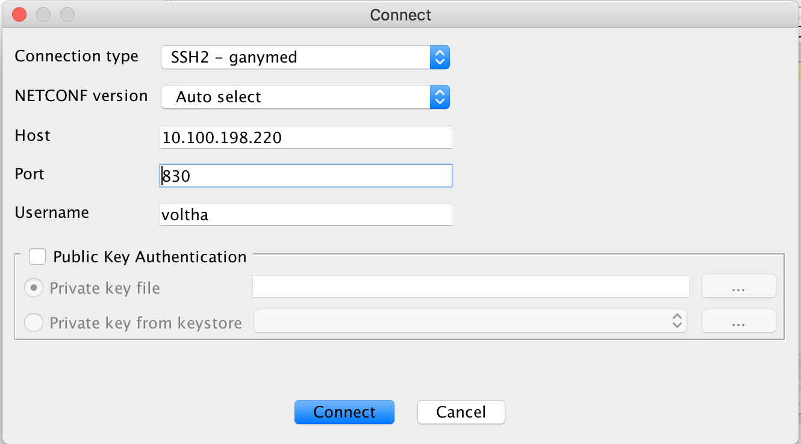
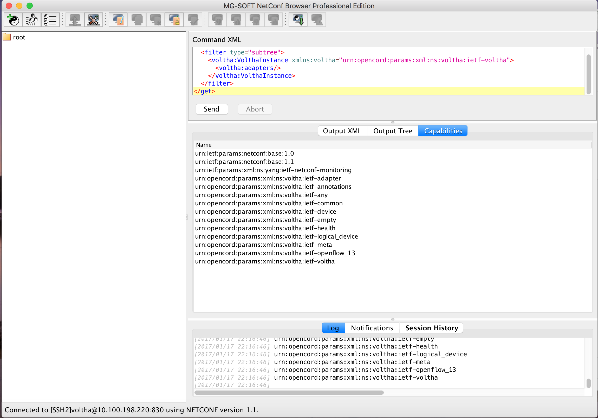

# N2 - Connect to Netconf Server using a Netconf Browser

## Test Objective

* The purpose of this test is to verify the SSH connectivity between the Netconf Browser and the Netconf Server

## Test Configuration

* Preparatory steps completed
* Test-case N01 completed successfully
* A netconf browser is available.  MG Soft Netconf Browser will be used in the subsequent test procedures 

## Test Procedure

* Connect to the Netconf Server 
    * Open a Netconf Browser (MG Soft in our case).  
    * From the *File* menu select *connect* option. 
    * Use the following values when prompted:

```shell
Host :  <server-ip-or-hostname> 
Port : 830
Username : voltha
```

Do not select *Public Key Authentication*. While the server supports this authentication method the client key will need to be added to the Netconf server first. For ease of the test procedure we will only use username and password. The picture below shows the connect window.



* Select *connect* from the pop-up window
* When prompted for the password, enter *voltha*

## Pass/Fail Criteria

After successfully authenticating the user, the NETCONF session handshake occurs where the server and client exchange the Hello messages with the NETCONF capabilities they support. When the capabilities are successfully exchanged, the NETCONF session is established.

* The status bar on the Netconf Browser should display :

```shell
Connected To [SSH]voltha@<server-ip>:830 using NETCONF version 1.1
```

* Select the *capabilities* widget in the output window. The following server capabilities should be displayed:

```xml
urn:ietf:params:netconf:base:1.0
urn:ietf:params:netconf:base:1.1
urn:ietf:params:xml:ns:yang:ietf-netconf-monitoring
urn:opencord:params:xml:ns:voltha:ietf-adapter
urn:opencord:params:xml:ns:voltha:ietf-annotations
urn:opencord:params:xml:ns:voltha:ietf-any
urn:opencord:params:xml:ns:voltha:ietf-common
urn:opencord:params:xml:ns:voltha:ietf-device
urn:opencord:params:xml:ns:voltha:ietf-empty
urn:opencord:params:xml:ns:voltha:ietf-health
urn:opencord:params:xml:ns:voltha:ietf-logical_device
urn:opencord:params:xml:ns:voltha:ietf-meta
urn:opencord:params:xml:ns:voltha:ietf-openflow_13
urn:opencord:params:xml:ns:voltha:ietf-voltha
```

* Below is a picture of a connected Netconf Browser.


