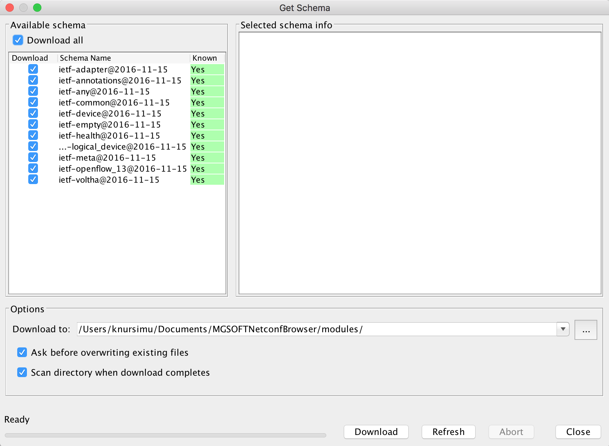
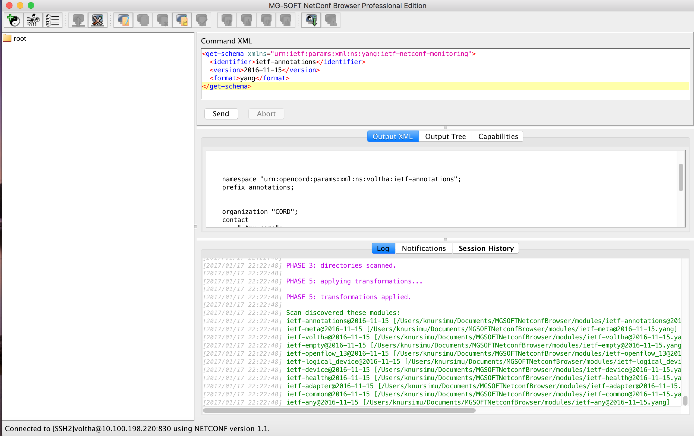
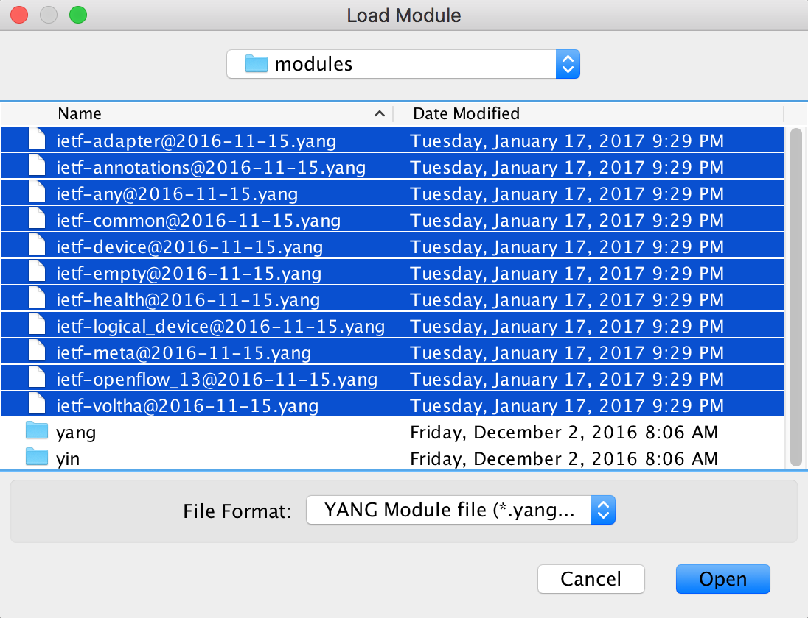
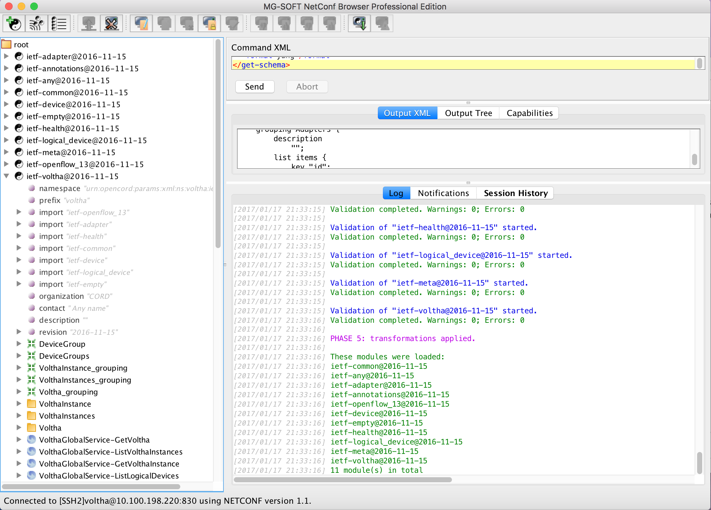

# N3 - Retrieve and Load the Voltha YANG Modules

## Test Objective

* The purpose of this test is to retrieve and load the voltha YANG modules from the Netconf Server

## Test Configuration

* Preparatory steps completed
* Test-cases N01 and N02 completed successfully
* The Netconf client/server connection is up
* No Voltha YANG modules has been loaded into MG Soft.  If the modules were loaded from a prior test, then select *Unload All Modules* from the *Module* menu to clear them.

## Test Procedure

* Retrieve voltha schemas
    * From the *Tools* menu select *Get Schema...* option. A window will be displayed with a list of schemas.
 


    * On the displayed window:
        * check the *Download all* box
        * under *options* enter the location where the YANG modules will be download to (*Download To*)
        * select the *Download* button

The YANG modules will be downloaded to the specified location. If the modules were downloaded before then the user will be prompted to allow for overwrite.

* After the download is complete, select the *close* button from the displayed window.

The Netconf Browser will show the following screens.



* Load the YANG Modules
    * From the ```Module``` menu select ```Load Module...``` option. 
    * On the displayed window:
        * browse to the location where the YANG modules were downloaded
        * select all the following files:

```shell
ietf-adapter@2016-11-15
ietf-annotations@2016-11-15
ietf-any@2016-11-15
ietf-common@2016-11-15
ietf-device@2016-11-15
ietf-empty@2016-11-15
ietf-health@2016-11-15
ietf-logical_device@2016-11-15
ietf-meta@2016-11-15
ietf-openflow_13@2016-11-15
ietf-voltha@2016-11-15
```

* select the *open button*



The Netconf Browser will scan, validate and load the modules. On successful loading, the modules will be displayed on the left window pane of the Browser:



At this point you can view the content of the Voltha YANG Modules by browsing through them.

## Pass/Fail Criteria

This test case should be considered passing if all the demonstrated behavior works with similar (but not necessarily identical) output.
