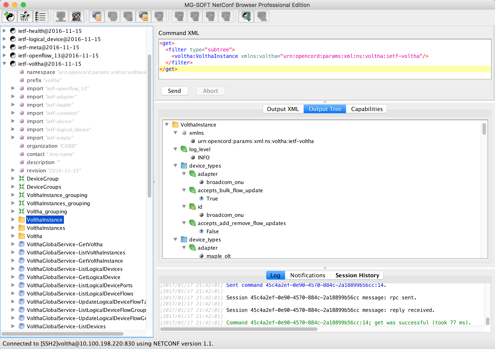

# N4 - Get VolthaInstance info

## Test Objective

* The purpose of this test is to run a simple GET command that would retrieve the *VolthaInstance* info.

## Test Configuration

* Preparatory steps completed
* Test-cases N01, N02 and N03 completed successfully
* The Netconf client/server connection is up

## Test Procedure

* Execute the GET command on the VolthaInstance 
    * Expand the *ietf-voltha@2016-11-15* module on the left pane of the Netconf Browser 
    * Select the *VolthaInstance* container
    * Right click and select *get(execute)* command

## Pass/Fail Criteria

Upon successful execution of the command, the similar output as below will be 
displayed:

* In the logs windows:

```shell
Command 404d0eb7-4008-48b1-a0e5-10596a3a421f:15; get was successful (took 75 ms).
```

* In the output pane, the *Output XML* would be similar to:

```xml
<?xml version="1.0" encoding="utf-8"?>
    <data xmlns="urn:ietf:params:xml:ns:netconf:base:1.0">
      <VolthaInstance xmlns="urn:opencord:params:xml:ns:voltha:ietf-voltha">
        <log_level>INFO</log_level>
        <device_types>
          <adapter>broadcom_onu</adapter>
          <accepts_bulk_flow_update>True</accepts_bulk_flow_update>
          <id>broadcom_onu</id>
          <accepts_add_remove_flow_updates>False</accepts_add_remove_flow_updates>
        </device_types>
        <device_types>
          <adapter>maple_olt</adapter>
          <accepts_bulk_flow_update>True</accepts_bulk_flow_update>
          <id>maple_olt</id>
          <accepts_add_remove_flow_updates>False</accepts_add_remove_flow_updates>
        </device_types>
        <device_types>
          <adapter>microsemi</adapter>
          <accepts_bulk_flow_update>True</accepts_bulk_flow_update>
          <id>microsemi</id>
          <accepts_add_remove_flow_updates>False</accepts_add_remove_flow_updates>
        </device_types>
        <device_types>
          <adapter>ponsim_olt</adapter>
          <accepts_bulk_flow_update>True</accepts_bulk_flow_update>
          <id>ponsim_olt</id>
          <accepts_add_remove_flow_updates>False</accepts_add_remove_flow_updates>
        </device_types>
        <device_types>
          <adapter>ponsim_onu</adapter>
          <accepts_bulk_flow_update>True</accepts_bulk_flow_update>
          <id>ponsim_onu</id>
          <accepts_add_remove_flow_updates>False</accepts_add_remove_flow_updates>
        </device_types>
        <device_types>
          <adapter>simulated_olt</adapter>
          <accepts_bulk_flow_update>True</accepts_bulk_flow_update>
          <id>simulated_olt</id>
          <accepts_add_remove_flow_updates>False</accepts_add_remove_flow_updates>
        </device_types>
        <device_types>
          <adapter>simulated_onu</adapter>
          <accepts_bulk_flow_update>True</accepts_bulk_flow_update>
          <id>simulated_onu</id>
          <accepts_add_remove_flow_updates>False</accepts_add_remove_flow_updates>
        </device_types>
        <device_types>
          <adapter>tibit_olt</adapter>
          <accepts_bulk_flow_update>True</accepts_bulk_flow_update>
          <id>tibit_olt</id>
          <accepts_add_remove_flow_updates>False</accepts_add_remove_flow_updates>
        </device_types>
        <device_types>
          <adapter>tibit_onu</adapter>
          <accepts_bulk_flow_update>True</accepts_bulk_flow_update>
          <id>tibit_onu</id>
          <accepts_add_remove_flow_updates>False</accepts_add_remove_flow_updates>
        </device_types>
        <instance_id>compose_voltha_1</instance_id>
        <version>0.9.0</version>
        <health>
          <state>HEALTHY</state>
        </health>
        <adapters>
          <config>
            <log_level>INFO</log_level>
          </config>
          <version>0.4</version>
          <vendor>Voltha project</vendor>
          <id>broadcom_onu</id>
        </adapters>
        <adapters>
          <config>
            <log_level>INFO</log_level>
          </config>
          <version>0.4</version>
          <vendor>Voltha project</vendor>
          <id>maple_olt</id>
        </adapters>
        <adapters>
          <config>
            <log_level>INFO</log_level>
          </config>
          <version>0.1</version>
          <vendor>Microsemi / Celestica</vendor>
          <id>microsemi</id>
        </adapters>
        <adapters>
          <config>
            <log_level>INFO</log_level>
          </config>
          <version>0.4</version>
          <vendor>Voltha project</vendor>
          <id>ponsim_olt</id>
        </adapters>
        <adapters>
          <config>
            <log_level>INFO</log_level>
          </config>
          <version>0.4</version>
          <vendor>Voltha project</vendor>
          <id>ponsim_onu</id>
        </adapters>
        <adapters>
          <config>
            <log_level>INFO</log_level>
          </config>
          <version>0.1</version>
          <vendor>Voltha project</vendor>
          <id>simulated_olt</id>
        </adapters>
        <adapters>
          <config>
            <log_level>INFO</log_level>
          </config>
          <version>0.1</version>
          <vendor>Voltha project</vendor>
          <id>simulated_onu</id>
        </adapters>
        <adapters>
          <config>
            <log_level>INFO</log_level>
          </config>
          <version>0.1</version>
          <vendor>Tibit Communications Inc.</vendor>
          <id>tibit_olt</id>
        </adapters>
        <adapters>
          <config>
            <log_level>INFO</log_level>
          </config>
          <version>0.1</version>
          <vendor>Tibit Communications Inc.</vendor>
          <id>tibit_onu</id>
        </adapters>
      </VolthaInstance>
    </data>
```

* In the output pane, the ```Output Tree``` would display a well formed tree as per the YANG module definition.  


