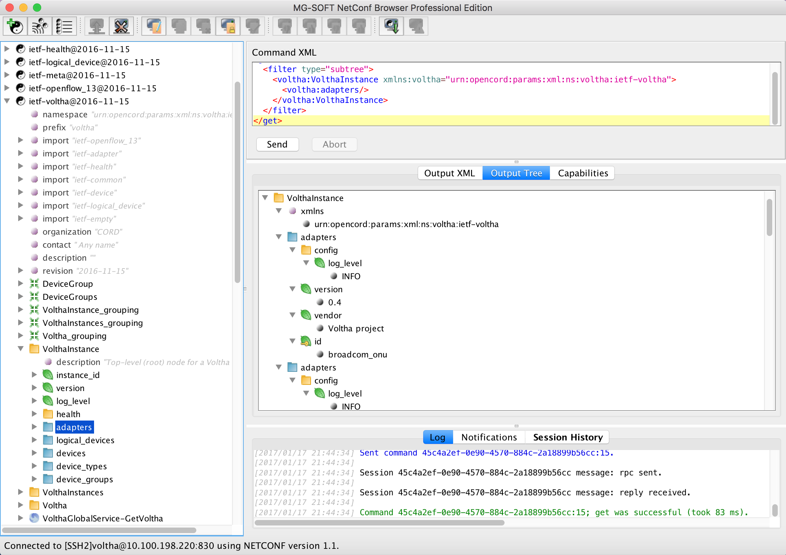

# N5 - Get List of Adapters

## Test Objective

* The purpose of this test is to retrieve the list of adapters

## Test Configuration

* Preparatory steps completed
* Test-cases N01, N02 and N03 completed successfully
* The Netconf client/server connection is up

## Test Procedure

* Execute the GET command on the VolthaInstance/adapters
    * Expand the *ietf-voltha@2016-11-15* module on the left pane of 
    the Netconf Browser 
    * Expand the *VolthaInstance* container
    * Select the *adapters* grouping
    * Right click and select *get(execute)* command

## Pass/Fail Criteria

Upon successful execution of the command, the similar output as below will be displayed:

* In the logs windows:

```shell
Command 404d0eb7-4008-48b1-a0e5-10596a3a421f:17; get was successful (took 76 ms).
```

* In the output pane, the *Output XML* would be similar to:

```xml
<?xml version="1.0" encoding="utf-8"?>
<data xmlns="urn:ietf:params:xml:ns:netconf:base:1.0">
  <VolthaInstance xmlns="urn:opencord:params:xml:ns:voltha:ietf-voltha">
    <adapters>
      <config>
        <log_level>INFO</log_level>
      </config>
      <version>0.4</version>
      <vendor>Voltha project</vendor>
      <id>broadcom_onu</id>
    </adapters>
    <adapters>
      <config>
        <log_level>INFO</log_level>
      </config>
      <version>0.4</version>
      <vendor>Voltha project</vendor>
      <id>maple_olt</id>
    </adapters>
    <adapters>
      <config>
        <log_level>INFO</log_level>
      </config>
      <version>0.1</version>
      <vendor>Microsemi / Celestica</vendor>
      <id>microsemi</id>
    </adapters>
    <adapters>
      <config>
        <log_level>INFO</log_level>
      </config>
      <version>0.4</version>
      <vendor>Voltha project</vendor>
      <id>ponsim_olt</id>
    </adapters>
    <adapters>
      <config>
        <log_level>INFO</log_level>
      </config>
      <version>0.4</version>
      <vendor>Voltha project</vendor>
      <id>ponsim_onu</id>
    </adapters>
    <adapters>
      <config>
        <log_level>INFO</log_level>
      </config>
      <version>0.1</version>
      <vendor>Voltha project</vendor>
      <id>simulated_olt</id>
    </adapters>
    <adapters>
      <config>
        <log_level>INFO</log_level>
      </config>
      <version>0.1</version>
      <vendor>Voltha project</vendor>
      <id>simulated_onu</id>
    </adapters>
    <adapters>
      <config>
        <log_level>INFO</log_level>
      </config>
      <version>0.1</version>
      <vendor>Tibit Communications Inc.</vendor>
      <id>tibit_olt</id>
    </adapters>
    <adapters>
      <config>
        <log_level>INFO</log_level>
      </config>
      <version>0.1</version>
      <vendor>Tibit Communications Inc.</vendor>
      <id>tibit_onu</id>
    </adapters>
  </VolthaInstance>
</data>      
```

* In the output pane, the *Output Tree* would display a well formed tree as per the YANG module definition


