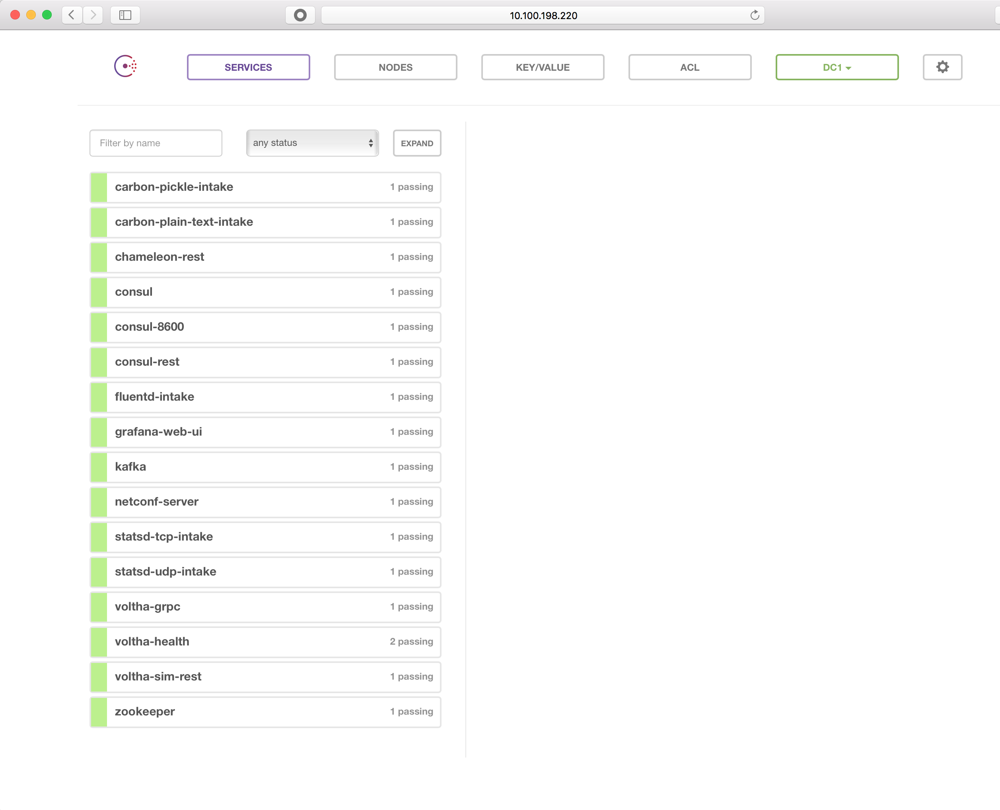

# V1 - Deploy Voltha and Verify its Vital Signs

## Test Objective

* Purpose of this test is to launch Voltha together with all of its dependencies and verify that all are in working condition,

## Test Configuration

* This test setup requires only the test server and it should have been prepared as described in the [preparation](preparations.md) section.
* Voltha has not been running yet (will verify it in the process)
* Test server has been prepared as above

## Test Procedure

* Login to the test server with standard user credentials
* Navigate to the Voltha installation directory. For example:
    
```shell
cd cord/incubator/voltha
```

* Source the environment:

```shell
source env.sh
```

* Verify that no docker containers are running on the server:

```shell
docker ps -a
```

This shall show only a title line, but no containers. If any containers
are running, you can terminate them as follows:

```shell
docker ps -a | grep -v CONT | awk '{print $1}' | xargs docker rm -f
```

* Launch Voltha and it companion containers (the "test deployment ensemble")using docker-compose in the background:
  
```shell
docker-compose -f compose/docker-compose-system-test.yml up -d
```

Note: The expected outcome is show below. Order is not important.

```shell
Creating compose_fluentd_1
Creating compose_consul_1
Creating compose_registrator_1
Creating compose_voltha_1
Creating compose_ofagent_1
Creating compose_chameleon_1
Creating compose_netconf_1
Creating compose_zookeeper_1
Creating compose_kafka_1
Creating compose_grafana_1
Creating compose_shovel_1
```

Note: We need to make sure the ponmgmt bridge can forward multicast mac addresses

```shell
echo 8 > /sys/class/net/ponmgmt/bridge/group_fwd_mask
```

## Pass/Fail Criteria (Installation Checkpoint)

* The installation steps to this point should complete without errors.
* Please check that docker-compose shows all containers as running. In the same Linux terminal, please issue the following command: 

```shell
docker-compose -f compose/docker-compose-system-test.yml ps
```

This shall list all containers being in the "Up" state. Expected output (lines are truncated omitting the long port mapping information):

```shell
          Name                       Command               State         ...
-------------------------------------------------------------------------...
compose_chameleon_1     /chameleon/chameleon/main. ...   Up      0.0.0.0:...
compose_consul_1        docker-entrypoint.sh agent ...   Up      0.0.0.0:...
compose_fluentd_1       /bin/sh -c exec fluentd -c ...   Up      0.0.0.0:...
compose_grafana_1       /usr/bin/supervisord             Up      0.0.0.0:...
compose_kafka_1         start-kafka.sh                   Up      0.0.0.0:...
compose_netconf_1       /netconf/netconf/main.py - ...   Up      0.0.0.0:...
compose_ofagent_1       /ofagent/ofagent/main.py - ...   Up
compose_registrator_1   /bin/registrator -ip=10.0. ...   Up
compose_shovel_1        /shovel/shovel/main.py --k ...   Up
compose_voltha_1        /voltha/voltha/main.py -v  ...   Up      0.0.0.0:...
compose_zookeeper_1     /bin/sh -c /usr/sbin/sshd  ...   Up      0.0.0.0:...
```

Shovel is known to have some startup race condition issues. If it is shown in the "Exited" state, a single attempt can be made to restart it, after which it should be healthy. To restart it, execute:

```shell
docker-compose -f compose/docker-compose-system-test.yml scale shovel=1
```

and repeat the above "ps" command to view the ensemble state:

```shell
docker-compose -f compose/docker-compose-system-test.yml ps
```

* Point a Web Browser to the Consul UI to verify that all components are properly registered.

Point your browser to <http://<server-ip-or-hostname>:8500/ui> using the actual IP address or valid DNS name of your Voltha server. The expected view is similar to the following:



Here every single exposed service end-point is shown (some components expose multiple end-points, while others expose no public endpoints).

Clicking on any of the items reveal further information like the specific IP address(es) and port number(s) for the service.
