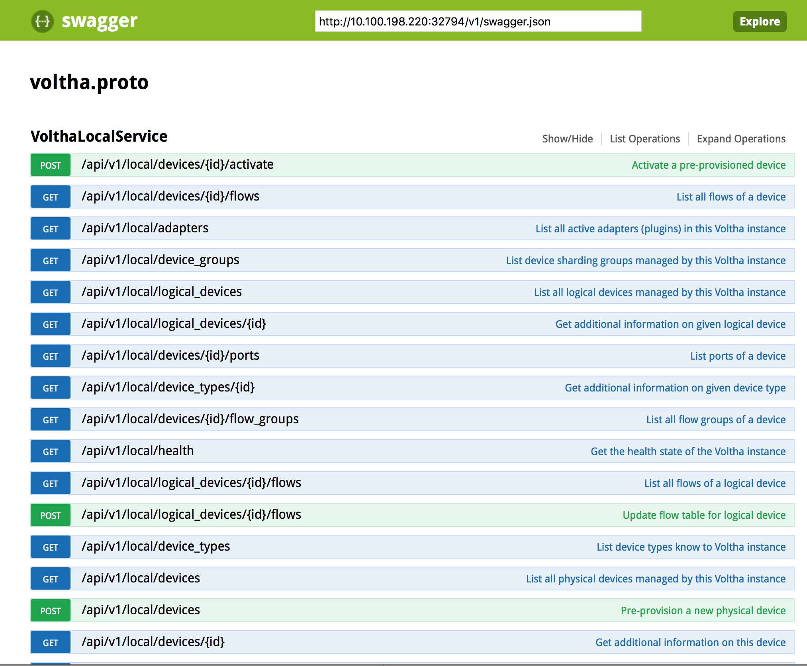
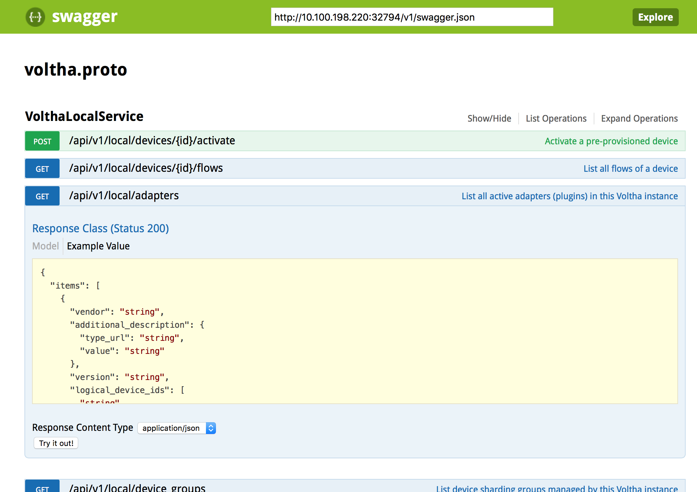

# V2 - Connect to Voltha with REST and Web Browser or Curl

## Test Objective

* The purpose of this test is to verify REST-based HTTPS connectivity to Voltha, including
    * Swagger UI access for exploring APIs
    * Command-line REST requests using curl

## Test Configuration

* Preparatory steps completed
* Test-case V1 completed successfully

## Test Procedure

To conveniently explore the REST APIs exposed by Voltha, point your browser to the default REST port on the Voltha integrartion server's Swagger end-point using the URL ```https://<server>:<chameleon-port>/#/VolthaLocalService```, where:

* *server* is the IP address or hostname of your Voltha integration server
* *chameleon-port* is the TCP port assigned to the Chameleon REST front-end

In a real depoyment this port will be served by a load balancer using a fixed port number, but in the integration setup this port number is a port assigned by Docker.

To find out what the port is, do either of the following:

You can look up the port number using docker. On the integration server, run:

```shell
docker inspect compose_chameleon_1 | jq -r '.[0].NetworkSettings.Ports["8881/tcp"][0].HostPort'
```

This should print the port number that is mapped to the Chameleon internal REST port. In our case it printed the following:
  
```shell
32794
```

Alternatively, you can use a DNS lookup. The Consul process in the Voltha ensamble also works as a DNS server and supports service record lookup. So you can use ```dig``` to lookup the port number. One way to do this is to issuethe following command on *the integration server*:
  
```shell
dig @localhost -p 8600 +short chameleon-rest.service.consul SRV
```

This basically requests for the service record (SRV) for the service
registered with Consul as ```chameleon-rest``` end-point. Example output:

```shell
1 1 32794 0a00020f.addr.dc1.consul.
```

The 3rd field is the port number.

Either way, make note of the port-number and use this to talk to the REST APIs.

Using the proper URL, which in our case was <https://10.100.198.220:32794/#/VolthaLocalService> shall lead you to the following view in your browser:



Swagger allows the user to browse in the APIs and try any of the APIs with relative ease. For instance, to list all adapters registered with Voltha, open up the */api/v1/local/adapters* entry:
  


To try this API, click on the *Try it out!* button. The response will show up below it:


* The REST API can be consumed via any REST client. Here we verify that the Unix tool *curl* can be used. Here are a couple of examples:

For convenience, setup an env var for the b ase URL:

```shell
export VOLTHAURL='https://10.100.198.220:32794/api/v1/local'
```

To show the health status of Voltha:
 
```shell
curl -k -s $VOLTHAURL/health | jq '.'
```

Expect to see:

```json
  {
    "state": "HEALTHY"
  }
```

To show the list of loaded adapters in Voltha 

```shell
curl -k -s $VOLTHAURL/adapters | jq '.'
```

Expect to see a list similar to this snippet (we show here only the beginning):

```json
{
  "items": [
    {
      "config": {
        "log_level": "INFO"
      },
      "version": "0.1",
      "vendor": "Voltha project",
      "id": "broadcom_onu",
      "logical_device_ids": []
    },
    {
      "config": {
        "log_level": "INFO"
      },
      "version": "0.1",
      "vendor": "Voltha project",
      "id": "maple_olt",
      "logical_device_ids": []
    },
   ...
   ...
```

You can list only the names of the adapters:

```shell
curl -k -s $VOLTHAURL/adapters | jq '.items[].id'
```

This will show something like:

```shell
"broadcom_onu"
"maple_olt"
"ponsim_olt"
"ponsim_onu"
"simulated_olt"
"simulated_onu"
"tibit_olt"
"tibit_onu"
```

## Pass/Fail Criteria

This test case should be considered passing if all the demonstrated behavior works with similar (but not necessarily identical) output.
